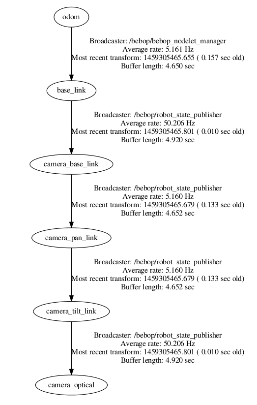

******************
Reading from Bebop
******************

Camera
======

The video stream from Bebop's front camera is published on ``image_raw`` topic as ``sensor_msgs/Image`` messages. *bebop_driver* complies with ROS camera interface specifications and publishes camera information and calibration data to ``camera_info`` topic. Due to limitations in Parrot's ARDroneSDK3, the quality of video stream is limited to **640 x 368 @ 30 Hz**. The field of view of this virtual camera (based on our measurements) is ~80 (horizontal) and ~50 (vertical) degrees.

To set the location of camera calibration data, please check this page: :doc:`configuration`. Since v0.4, the package ships with a default camera caliberation file located at ``bebop_driver/data/bebop_front_calib.yaml``. Both default node/nodelet launch files, load this file when executing the driver.

.. _sec-ros-topic:

Standard ROS messages
=====================

.. _sec-odom:

Odometery
---------

.. versionadded:: 0.5

* ROS Topic: ``odom``
* ROS Message Type: ``nav_msgs/Odometry``

The driver integerates visual-inertial velocity estimates reported by Bebop's firmware to calculate the odometery. This message contains both the position and velocity of the Bebop in an ENU aligned odometery frame also named as ``odom``. This frame name is configurable (see :ref:`sec-params`) The cooridnate frame convention complies with ROS REP 103 (:ref:`sec-coords`). Please not that since odometery is calculated from Bebop States (see :ref:`sec-states`), the update rate is limited to **5 Hz**.

.. _sec-gps:

GPS
---

.. versionadded:: 0.5

* ROS Topic: ``fix``
* ROS Message Type: ``sensor_msgs/NavSatFix``

Joint States (Pan/Tilt of The Virtual Camera)
---------------------------------------------

.. versionadded:: 0.5

* ROS Topic: ``joint_states``
* ROS Message Type: ``sensor_msgs/JointState``

.. _sec-tf:

TF
==

.. versionadded:: 0.5

The driver updates the following `TF <http://wiki.ros.org/tf>`_ tree based on a simple kinematic model of the Bebop (provided by ``bebop_description``) pacakge, the current state of the virtual camera joints and the calculated odometery (if ``publish_odom_tf`` is set, see :ref:`sec-params`).

.. _sec-states:

States (aka Navdata)
====================

Unlike Parrot ARDrone, Bebop does not constantly transmit all on-board data back to the host device with high frequency. Each state variable is sent only when its value is changed. In addition, the publication rate is currently limited to **5 Hz**. The driver publishes these states **selectively** and when **explicitly** enabled through a ROS parameter. For example setting ``~states/enable_pilotingstate_flyingstatechanged`` parameter to ``true`` will enable the publication of flying state changes to topic ``states/ARDrone3/PilotingState/FlyingStateChanged``. List of all such parameters and their corresponding topics and message types are indexed in the following pages:

Common States
  :doc:`autogenerated/common_states_param_topic`
Bebop-specific States
  :doc:`autogenerated/ardrone3_states_param_topic`

